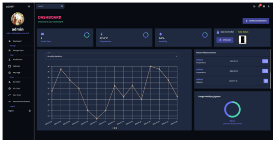
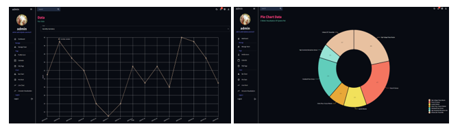

# Smart Home App

Welcome to the Smart Home App! This application allows you to effortlessly manage and monitor your home environment using an Arduino Uno and a user-friendly interface. Whether you're concerned about temperature, humidity, or security, this app has got you covered. Additionally, the app provides insightful data visualization through graphs and offers role-based access control for different users.

## Features

### Environmental Monitoring

- **Temperature Data**: Communicate with your Arduino Uno to retrieve real-time temperature data from various sensors placed around your home.

- **Humidity Data**: Get instant humidity readings from different rooms and areas, ensuring your living spaces are always comfortable.

- **Intrusion Detection**: Receive alerts and notifications if any unauthorized entry is detected, enhancing your home's security.

### Gate Control

- **Gate Management**: Seamlessly control the opening and closing of your gate through the app. No need to leave your seat to manage your property's entrance.

### Data Visualization

- **Graphical Representation**: Visualize historical temperature and humidity data through interactive graphs. Gain insights into environmental trends over time.

### Role-Based Access

- **User Roles**: Different users have different levels of access. Administrators can manage settings, add or remove devices, while standard users can monitor and control devices without administrative privileges.

- **Customized Pages**: The app adapts its interface based on the user's role, ensuring that students and administrators see the most relevant information and features.

## Getting Started

1. **Installationg**: Clone all the repositories

2. **Connect Arduino Uno**: Follow the provided instructions to connect your Arduino Uno to the app. Ensure you have the necessary sensors and actuators properly set up.

3. **Pairing and Authorization**: Pair your Arduino Uno with the app. Based on your user role (student or admin), the app will present the appropriate features and pages.

4. **Monitor and Control**: Access real-time temperature and humidity data from various parts of your home. Receive notifications for any intrusions. Use the app to remotely operate your gate.

5. **Visualize Data**: Explore historical data using interactive graphs. Identify patterns and trends in temperature and humidity changes.

## Compatibility

The Smart Home App is designed to work seamlessly with Arduino Uno and related components. Make sure you have a stable internet connection and proper hardware setup to utilize all the features.

## Security

Your security is our top priority. The Smart Home App uses encryption to protect your data and ensure that only authorized users can access and control your home environment.

## Screenshots

Reference Link
[edroh Github](https://github.com/ed-roh/react-admin-dashboard)

## Support

If you have any questions, concerns, or feedback, please contact our support team at. We are dedicated to making your smart home experience as smooth as possible.

---